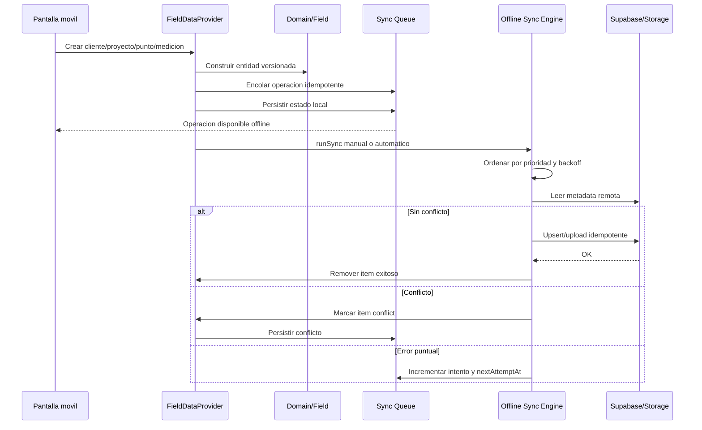
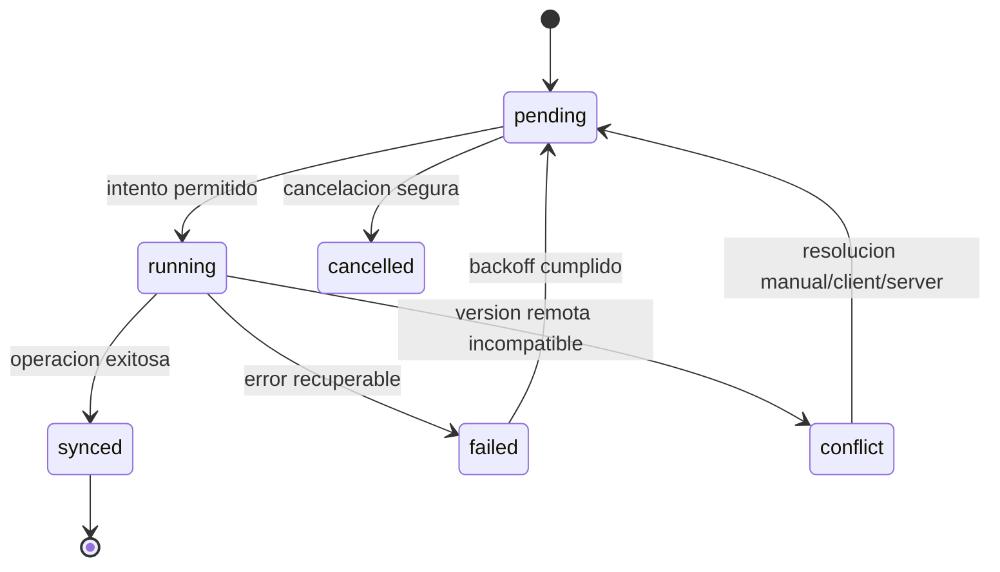

# Sprint 3 - Motor Offline First Empresarial

Fecha: 2026-06-29

Estado: cerrado tecnicamente. No se ejecuto Sprint 4.

## Resumen ejecutivo

Sprint 3 implemento un motor de sincronizacion Offline First sobre la arquitectura estabilizada en Sprint 2. La interfaz funcional de la aplicacion no cambia: los flujos de clientes, proyectos, puntos, mediciones, fotografias y reportes siguen operando igual. La diferencia es interna: cada operacion queda versionada, encolada, auditable, priorizada y recuperable.

## Arquitectura del motor

Capas principales:

- `packages/shared/src/types.ts`: contratos compartidos de versionado, cola, conflictos y telemetria.
- `apps/mobile/src/application/sync/offline-sync-config.ts`: politicas configurables de prioridad, backoff, intentos y calidad fotografica.
- `apps/mobile/src/application/sync/offline-sync-engine.ts`: motor puro de cola, versionado, idempotencia, backoff, conflictos y telemetria.
- `apps/mobile/src/application/sync/field-sync-service.ts`: ejecutor Supabase/Storage con deteccion de conflictos y procesamiento parcial.
- `apps/mobile/src/infrastructure/storage/offline-field-state-store.ts`: persistencia durable de estado, cola, device id y normalizacion de estados antiguos.
- `apps/mobile/providers/field-data-provider.tsx`: fachada React compatible con las pantallas.
- `apps/mobile/app/sync.tsx`: panel tecnico de sincronizacion.
- `supabase/migrations/0003_offline_first_sync_engine.sql`: soporte backend para metadata, operaciones, conflictos y telemetria.

## Versionado

Cada entidad creada localmente incorpora metadata `sync`:

- `version`
- `updatedBy`
- `deviceId`
- `syncVersion`
- `deletedAt`
- `syncStatus`

En base de datos, la migracion agrega columnas equivalentes a entidades operativas y crea triggers para mantener metadata de actualizacion. No se usan solo timestamps para detectar conflictos: el motor compara `sync_version`, `version` y `device_id`.

## Cola persistente

La cola mantiene compatibilidad con `action`, pero agrega:

- `operation`
- `entity`
- `userId`
- `deviceId`
- `priority`
- `attempts`
- `maxAttempts`
- `lastError`
- `lastAttemptAt`
- `nextAttemptAt`
- `status`
- `idempotencyKey`
- `conflict`

La cola se guarda en AsyncStorage junto con el estado completo. Al iniciar la app, se normalizan operaciones antiguas para no perder trabajos previos.

## Flujo completo

## Diagrama de estados

## Conflictos

El motor detecta:

- Edicion simultanea por `device_id` distinto y `sync_version` remoto mayor.
- Eliminacion remota mediante `deleted_at`.
- Conflictos de fotografia por entidad `photo`.
- Cambios incompatibles cuando la metadata remota supera la version local.

Politicas soportadas:

- `server-wins`
- `client-wins`
- `latest-version`
- `manual`

La politica por defecto es `manual`, para evitar sobrescritura automatica cuando exista riesgo de perdida.

## Reintentos

El motor aplica:

- Backoff exponencial.
- Maximo configurable de intentos.
- `nextAttemptAt` por operacion.
- Ordenamiento por prioridad.
- Procesamiento parcial: un error no bloquea toda la cola.

## Fotografias y archivos

Fotografias:

- Cola independiente por entidad `photo`.
- Subida diferida.
- Checksum local basado en URI/tamano/tipo.
- Metadata en Storage/tabla `photos` con `checksum`, `byteSize` e `idempotencyKey`.
- Calidad configurable desde `offline-sync-config.ts`.

Archivos:

- Se agrego el contrato `upload-file` y entidad `file`.
- La arquitectura queda preparada para documentos, PDF, evidencias y anexos con el mismo modelo de cola.

## Telemetria

Se calcula y persiste localmente:

- Tiempo promedio de sincronizacion.
- Operaciones pendientes.
- Operaciones exitosas.
- Operaciones fallidas.
- Conflictos detectados.
- Conflictos resueltos.
- Reintentos.
- Volumen sincronizado.
- Fotografias pendientes.
- Almacenamiento local estimado.

El panel tecnico en `/sync` muestra estos datos sin modificar la experiencia principal del usuario.

## Recuperacion

La app recupera estado despues de:

- Cierre inesperado.
- Reinicio.
- Perdida de bateria.
- Suspension.
- Perdida de Internet.
- Cambio de red.

La garantia se basa en persistencia inmediata del estado, cola durable en AsyncStorage, device id estable y reintentos idempotentes.

## Seguridad

El motor no omite los controles de Sprint 1:

- La sincronizacion usa el cliente Supabase autenticado.
- RLS valida organizacion y permisos.
- La migracion conserva aislamiento por tenant.
- Las operaciones se identifican con usuario y dispositivo.
- Conflictos y telemetria quedan preparados para auditoria en backend.

## QA ejecutado

| Prueba | Resultado |
| --- | --- |
| Typecheck monorepo | OK: shared, mobile y web. |
| Auditoria critica npm | OK: `npm audit --audit-level=critical` reporta 0 vulnerabilidades. |
| Normalizacion de cola antigua | Implementada en `normalizePersistedFieldState`. |
| Persistencia de cierre inesperado | Cola, conflictos, device id y telemetria quedan en AsyncStorage. |
| Error puntual de sincronizacion | Operacion queda `failed`, incrementa intentos y calcula `nextAttemptAt`. |
| Conflicto multi-dispositivo | Se detecta por `device_id` distinto y `sync_version` remoto mayor. |
| Eliminacion remota | Se detecta por `deleted_at` remoto. |
| Fotografia local | Upload diferido, checksum y metadata de integridad. |
| Panel tecnico | Muestra pendientes, errores, conflictos, reintentos, fotos, storage y tiempos. |
| Build web reproducible | Validado en copia limpia fuera de OneDrive. |
| Lint web reproducible | Validado en copia limpia fuera de OneDrive. |

## Limitaciones conocidas

- La compresion avanzada de imagenes queda configurada por calidad de captura. No se agrego una libreria de compresion para respetar la restriccion de no introducir dependencias innecesarias.
- La resolucion manual queda registrada en el modelo y panel, pero una pantalla dedicada de resolucion granular puede construirse despues si negocio lo exige.
- La validacion de modo avion/red real requiere dispositivo o emulador; en este entorno se valido por comportamiento de errores/reintentos y persistencia.

## Criterio de cierre

Sprint 3 queda cerrado tecnicamente porque:

- Existe motor Offline First con cola persistente.
- Las entidades locales se versionan.
- Hay deteccion de conflictos y politicas configurables.
- Hay reintentos con backoff exponencial.
- Fotografias usan cola, checksum y subida diferida.
- Existe telemetria persistente.
- Existe panel tecnico de sincronizacion.
- Typecheck, lint y build fueron validados.
- No se modificaron funcionalidades visibles principales.
